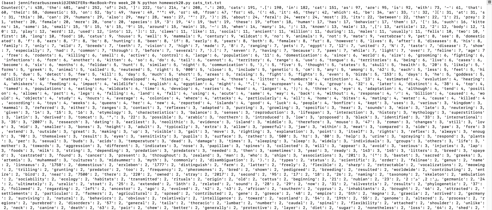
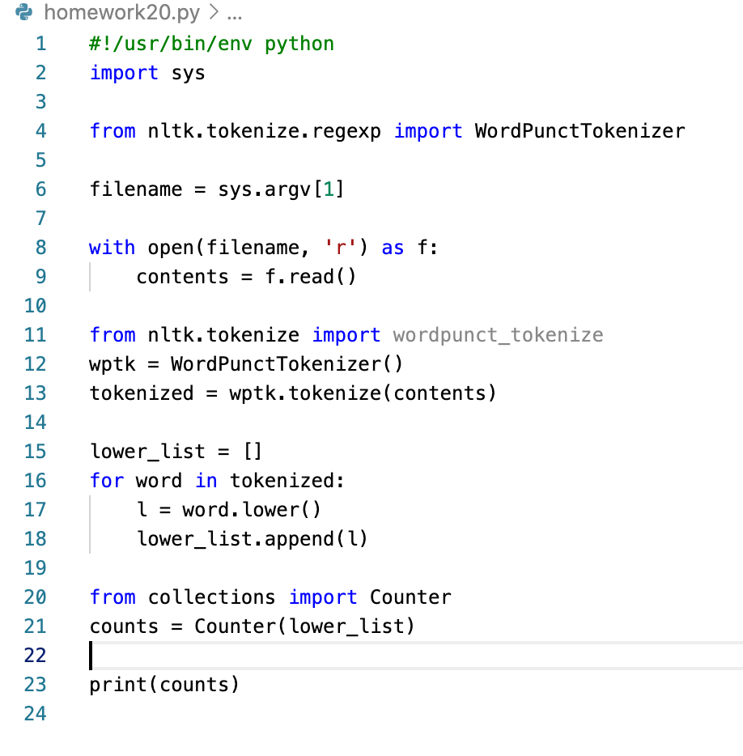

# Homework 20 Questions 1 & 2

### How to Run the Program from the Terminal:
##### Running from the command line:
**Example command line:**
(base) jenniferarbuszewski@JENNIFERs-MacBook-Pro week_20 % python homework20.py cats_txt.txt

1) Go to the correct folder where the Python program file is saved from the command line. 

2) Type `python homework20.py cats_txt.txt` to indicate the program should run in Python, the name of the python program (here, `homework20.py`), followed by the file that is to be read and used in the program (here, `cats_txt.txt). Hit return to run the program

3) If the program executes appropriately, a dictionary is returned which gives first the word or punctuation mark as the key followed by the number of occurrences as the value. The dictionary is ordered with the most commonly occurring words and punctuation first, and the least occurring words and punctuation last. 

**Example output for the cats file in Terminal:**

### How the python program works

**NOTE:** This program was constructed so that any file could be read in and then evaluated; in other words it is not specific to just the 'cats' file.

1) Use shabang line to tell script to use Python to run

2) Import the library called 'sys'--allows for systems call such as file opening

3) For readability, setting filename to argv. 
**Notes:**
argv is a list of arguments for the program.
argv[1] will give the name of the file.

4) filename = sys.argv[1] tells the program to take the 2nd argument and assume it is the file name

5) The rollowing will open the specified file and read it:
with open(filename, 'r') as f: 

6) A new variable is created and uses the  `read` function to extract the contents of the file:
contents = f.read()

7) The contents of the tile are printed to make sure the file was read correctly:
print(contents)

8) The tokenizer is imported and instantiated then is called to tokenize the file contents into both words and punctuation marks.

9) To ensure that capitalizations are not counted differently and are instead grouped together regardless of capitalization, everything is turned into a lower case and saved as a new list.

10) A new variable is defined and counter is called to create the dictionary of words/punctuation marks and number of occurrences for each. This dictionary is then printed.

**Screenshot of Python program:**

